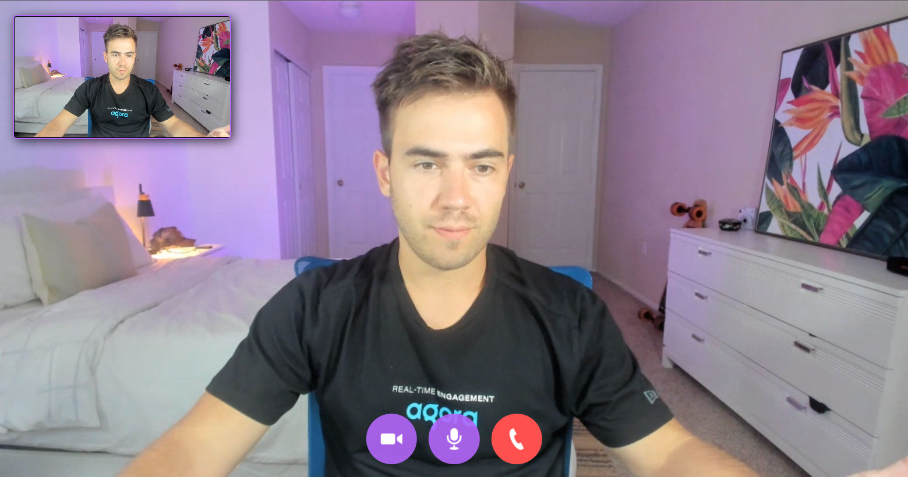

# Video Chat Website

Welcome to the Video Chat Website! This project allows you to create a virtual space for video conferencing with friends and colleagues. With a simple interface and powerful functionality, you can easily connect, chat, and collaborate using video and audio.

## Table of Contents

- [Introduction](#video-chat-website)
- [Features](#features)
- [Getting Started](#getting-started)
- [Usage](#usage)
- [Contributing](#contributing)
- [License](#license)

## Features

- Real-time video conferencing with friends and peers.
- Secure and reliable communication using Agora platform.
- User-friendly interface with options to toggle camera and microphone.
- Automatic resizing and layout adjustment for remote and local streams.
- Seamless handling of user joins and leaves within chat rooms.

## Getting Started

To run the Video Chat Website on your local machine, follow these steps:

# Installation

- 1 - clone repo https://github.com/divanov11/PeerChat
- 2 - Create an account on agora.io and create an app to generate an APP ID
- 3 - Update APP ID, Temp Token and Channel Name in main.js

```javascript
let APP_ID = "YOU-APP-ID";
```


